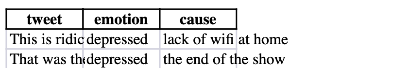
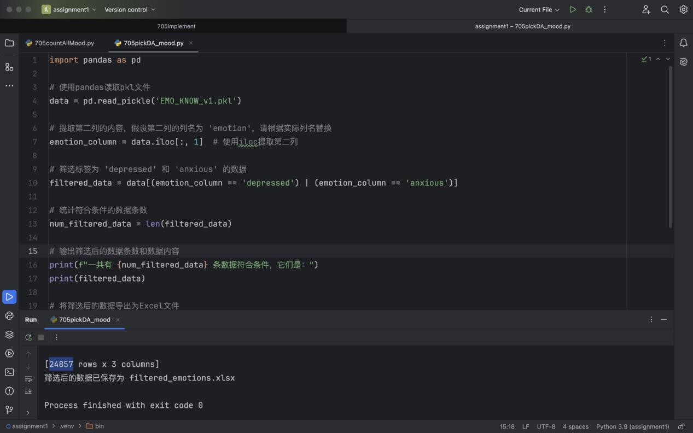

# Empathy Classification Model 

This project uses a fine-tuned RoBERTa model to classify empathy levels in conversations between a seeker (someone seeking emotional support) and a responder. The system supports three levels of empathy: 
1.**No empathy** (0) 
2.**Low empathy** (1) 
3.**High empathy** (2) 

It includes a Flask-based web interface for users to input text and receive empathy level predictions.

## Data Cleaning Process

In this project, we utilized the **EPITOME framework** to enhance the empathetic responses of a chatbot to tweets expressing negative emotions. To ensure that the model could effectively address these negative emotions, we used the **emo-know dataset** for training.

The **emo-know dataset** contains over 20,000 tweets, and each entry consists of three components:
1. Tweet content
2. Emotion label
3. The cause of the emotion

Since the focus of our experiment is on handling tweets with negative emotions, we performed data cleaning to isolate the relevant tweets before training the model.

### Data Cleaning Steps:
1. **Emotion Label Statistics**:  
   First, the project team developed the `705countAllMood.py` script to analyze and count the emotion labels present in the emo-know dataset. The analysis revealed **48 distinct emotion labels** in the dataset.

2. **Filtering Negative Emotion Data**:  
   Based on the project requirements, we selected two emotion labels related to negative emotions: `depressed` and `anxious`. Using the `705pickDA_mood.py` script, we extracted all the tweets tagged with these two labels. In total, we gathered **24,875 tweets** labeled with either `depressed` or `anxious`.

3. **Sampling for the Experiment**:  
   To conduct the experiment, we randomly selected **50 tweets labeled as `depressed`** and **50 tweets labeled as `anxious`** from the filtered data for model training and testing.

## Project Structure

1.model-training.py # Script for training the empathy classification model
2.empathy_model.py # Model definition (Epitome RoBERTa-based classifier)
3.app.py # Flask application for web interface and model inference
4.index.html # HTML form for user input (seeker and response)
5.result.html # HTML page for displaying empathy prediction results
6.labeled_csv.csv # CSV file containing training data (seeker, response, empathy labels)
7.empathy_classifier_model.pth # Trained model weights (generated after training)
8.base-model-no-training.py #Just a simple file for testing the untrained Epitome model, which is separate from the other files, using the same RoBERTa classifier based model, but untrained, it can also be used, and we've done some training on it.

## Data Format
The labeled_csv.csv file should contain the following columns:
1.seeker: The seeker's text
2.response: The response text (may have multiple entries)
3.label1 and label2: Two annotated empathy labels by group members (used to compute the average for training)
The responses in the CSV file are split based on numeric markers like 1., 2., etc.

##  Model Training
We trained the empathy classification model using the model-training.py script. This script reads the labeled_csv.csv file, processes the data, and trains a RoBERTa-based classifier.

### How It Works:
1.Data Processing:The script loads the CSV file, splits the responses into individual entries (if they are marked with numbers), and computes the average of two annotated labels by group members.
2.Model:The model is based on the RobertaModel from Hugging Face and uses a fully connected layer to classify the empathy level into 3 classes (No empathy, Low empathy, High empathy).
3.Training:The model is trained using cross-entropy loss and the Adam optimizer with a learning rate of 1e-5.
The trained model weights are saved as empathy_classifier_model.pth.
####To Train the Model:
Use terminal and input: python model-training.py
After training, the model will be saved as empathy_classifier_model.pth.

## Model Inference (Prediction)
Once the model is trained,it can use the Flask web interface to make predictions.
Inference Script: app.py

### How It Works:
1.Frontend (HTML Forms):
The user inputs the seeker and response text on the index.html form.
2.Backend (Flask):
The app.py script takes the input from the form, tokenizes it using RoBERTa's tokenizer, and passes it to the trained model to predict the empathy level.
3.Prediction Results:
The prediction result is displayed on result.html, showing the predicted empathy level and the probabilities for each class.

To Run the Flask Application:
Use terminal and input: python app.py
Then, open a browser and navigate to http://127.0.0.1:5000/ to access the application.

### Example
1.Navigate to http://127.0.0.1:5000/.
2.Enter the seeker text and response text in the input boxes.
3.Click the "Predict Empathy Level" button.
4.The application will display the predicted empathy level (No empathy, Low empathy, High empathy) along with the model's confidence scores for each class.

## Customization -------- Adjusting Hyperparameters
You can adjust the following parameters in the model-training.py script for better performance:
Learning Rate (lr): Adjust the learning rate in the Adam optimizer if the model is not converging well. For example:
optimizer = optim.Adam(model.parameters(), lr=2e-5)
Batch Size: Change the batch size in the DataLoader to handle larger batches if memory allows.
dataloader = DataLoader(dataset, batch_size=16, shuffle=True, collate_fn=collate_fn)
Number of Epochs: Increase or decrease the number of training epochs.
train_model(model, dataloader, criterion, optimizer, num_epochs=10)

## Complete steps to run the code:

1.Install modules and dependencies:

pip install pandas torch transformers flask

2.Input python model-training.py in the command line(or just run it,when it finish will print The model is saved as 'empathy_classifier_model.pth')  to start training the model. After completion, the trained model will be generated and saved (The training process may take a while.Don't worry).

3.Type python app.py in the command line(or just run it ). Open http://127.0.0.1:5000/ in your local browser

4. The remaining steps are to enter the dialog, click the button, and get the result!
   
## Enhancements
At present, we have not completely completed the training of the model, so in some cases there may be prediction errors, and we will continue to adjust the model and the data used for training to improve our model!

